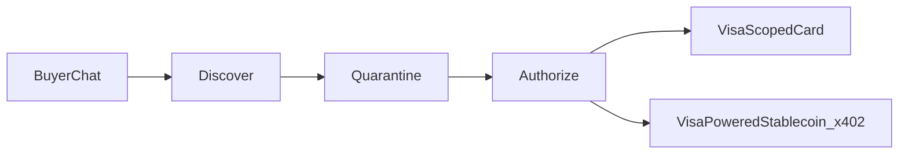

<div align="center">

# Borneo

[](#features)
[](#features)
[](#features)
[](#features)
[](https://nextjs.org/)
[](#get-running)

<br />


**AI shoppers discover and check out in one chat: Visa-scoped cards for fiat, plus a Visa-powered stablecoin rail when you want on-chain settle.**

Architecture → [`architecture.drawio`](./architecture.drawio) (open in [diagrams.net](https://app.diagrams.net/) — overview, product, protocol, x402, agents, data model).

</div>

---

## The problem

Agents still can’t shop like people.

- **No real card checkout** — most “agent shopping” demos scrape HTML, invent SKUs, or stop before money moves.
- **Merchants aren’t agent-ready** — human storefronts, no Visa receive path for AI buyers, no machine-readable catalog an agent can trust.
- **Trust dies at settle** — product copy tries to redirect the payee, skip authorize, or inject instructions into the pay agent.

**Borneo is where an AI can shop — and pay — like it has a real wallet and a real card.**

---

## Features

### 1. Visa-scoped checkout (fiat first)

Virtual card with **spend cap**, **merchant scope**, **TTL**, and **burn**. Nothing charges until the shopper **authorizes in chat**.

### 2. Merchant fiat receive

Sellers bind **Visa receive** + identity on setup. Dual-receive without leaving the agent flow — fiat lands where the merchant expects it.

### 3. Visa-powered stablecoin rail

Same conversation, second rail: **USDC on Base** via **HTTP 402 / x402** when you want on-chain settle. Fiat leads; stablecoin is opt-in, not the headline.

### 4. Personal salesperson buyer

Fashion chat that clarifies intent (date night? set vs one piece?), then ranks **live** SKUs across seller catalogs — not a hardcoded demo aisle.

### 5. Locked-quote settle

The pay path only sees a structured quote (slug / SKU / price / payee). **Catalog prose never enters the pay agent.**

### 6. Injection quarantine

Prompt-injection-shaped listings get flagged and held out of fashion picks. Settle still locks payee and amount even if someone taps a hostile title.

### 7. Agentic storefront protocol

Agents read `/llms.txt`, `/registry.json`, and `/s/{slug}/catalog.json`. **Do not scrape HTML.** Publish once — every agent on the network can discover you.

### 8. Conversational merchant onboard

Talk inventory, drop CSV, or paste a store URL → publish a live agent storefront.

### 9. Governance

Buyer spend limits (per tx / day / week). Merchant rails, price floors, market listing — policies that actually gate checkout.



---

## Try it

```bash
npm install
cp .env.example .env
npm run dev
```

Open [http://localhost:3000](http://localhost:3000).

| Path | What it is |
|---|---|
| `/buyer` | Salesperson chat → Visa or USDC settle |
| `/onboard` | Merchant agent: inventory → published store |
| `/market` | Human + agent marketplace index |
| `/dashboard` | Ops view of both payment rails |
| `/demo` | End-to-end protocol demo |
| `/s/hackathon-shirts/llms.txt` | Seed store agent discovery |

---

## Get running

### Prerequisites

- Node.js 20+ and npm
- **OpenAI API key** — buyer salesperson, merchant agent, Whisper
- **Firebase** web config — buyer / merchant auth
- (Optional) Funded Base Sepolia wallet with USDC for live x402 settlement

Without `OPENAI_API_KEY`, chat agents fall back to deterministic tools. Protocol endpoints (`llms.txt`, HTTP **402**) still work either way. Stores run in-memory locally — no AWS required.

### Setup

1. **Install**

```bash
cd Borneo
npm install
cp .env.example .env
```

2. **Fill `.env`** (see [`.env.example`](./.env.example))

| Var | Required? | Purpose |
|---|---|---|
| `OPENAI_API_KEY` | Recommended | Salesperson / merchant LLM + Whisper |
| `NEXT_PUBLIC_FIREBASE_*` | Recommended | Buyer + merchant Firebase Auth / Firestore |
| `MERCHANT_ADDRESS` | Recommended | Base Sepolia pay-to for x402 |
| `BUYER_PRIVATE_KEY` | Optional | Live USDC settlement; without it, **HTTP 402 still fires** |
| `BUYER_ADDRESS` | Optional | Buyer address paired with the key |

Base Sepolia defaults (RPC, chain id, Circle USDC, Basescan) are already in `.env.example`.

3. **Run**

```bash
npm run dev
```

### Scripts

| Command | Purpose |
|---|---|
| `npm run dev` | Local Next.js server |
| `npm run build` / `npm start` | Production build |
| `npm run lint` | ESLint |
